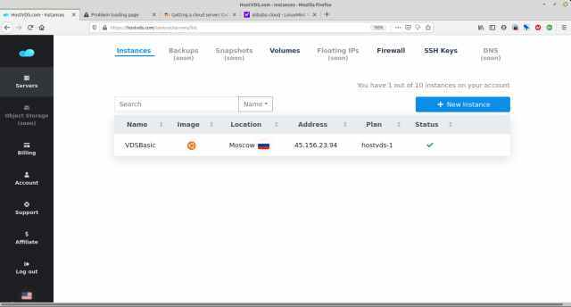

There are many places to get a barebones cloud server. I am going to use hostvds.com because of their very low price.There is a risk when we use a lower priced option that they may not be reliable. If this is important to you, try DigitalOcean or Linode. Current price for a standard 1 CPU 1 Gb of Ram is 79 cents per month on hostvds and $5 a month on Digital Ocean. Some providers  may even  give  trials on a basic server for up to 12 months. Most services are similar. Create an account, enter basic details and link a payment. 

This is the control panel for hostvps. We are going to add a new instance. This will create a new server.

Give our new server a basic name, select location (Moscow my only choice), choose Ubuntu and in the dropdown the latest version (18.04)

Select the lowest price option and deploy.

We now have a server and we can connect to it using the ip address.
There should also be an email sent to your address with login to your server and password.

###### Your server has been successfully launched 
Details 
Login: 	ubuntu 
Password: XXXXXXXXX 

This login and password will be used for a SSH connection.

