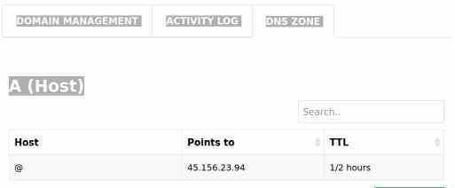

You can go to your site with the ip address of 4 numbers but it does look very professional.A domain can be as cheap as $1 so worth it took like a real site.

I will use Hostinger and found vdsbasic.xyz for 60 cents a year. All we have to do is point the new domain to the ip address. First fill out basic details.  You may have to wait a few minutes before the new domain is ready, This link shows you how to do this and this is the panel where you need to change the DNS  zone. Change the @ to your IP address.

All you need to buy on Hostinger is a domain. You do not need hosting services from them.