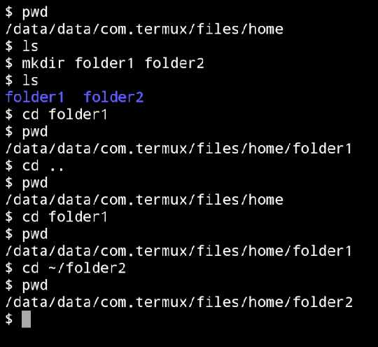

Open Termux or WSL and try these commands.

    pwd is used to show the current working directory. We are in our home directory. On WSL we will see <kbd>/home/grantm </kbd> 

<kbd>
ls
</kbd> lists the contents of the directory. This directory is empty as we have just opened Termux.

<kbd>
mkdir
</kbd> creates a directory and this command creates directories. You can create one directory or many, separating each directory mname with a space.

    <kbd>
ls
</kbd> lists the contents of the directory. Ths shows the two directories in a blue colour.

    <kbd>
cd
</kbd> is to change directories. This command puts us down a level in the folder1 directory. We can check where we are by using pwd.

<kbd>
cd ..
</kbd> takes us up a level. After tihs command we have gone from /home/folder1 back to the /home folder. 

<kbd>
cd folder1
</kbd> returns us to /home/folder1. If we want to get to folder2 we can traverse the file tree.  
    <kbd>
cd .. &nbsp;cd folder2</kbd>This is moving using relative references, fine here but a pain if you are deep in the file structure.  

Instead by using the command  <kbd>cd ~/folder2 </kbd>will take us straight there. The ~&nbsp; after the cd means change to the home directory.  

 
