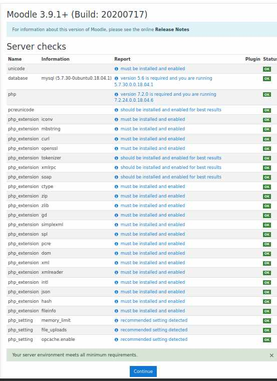
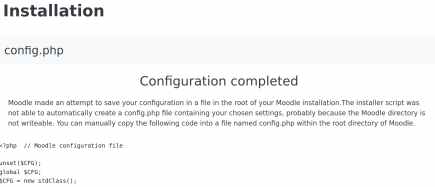

    
   
  First step is to remove our placeholder /var/www/moodle' direectory using the interactive and recursive flags.

sudo rm -ir /var/www/moodle

<pre>$ sudo rm -ir /var/www/moodle rm: descend into directory '/var/www/moodle'? y 
rm: remove regular file '/var/www/moodle/index.html'? y 
rm: remove directory '/var/www/moodle'? y</pre>

Change to the /var/www directory

cd /var/www

sudo git clone git://git.moodle.org/moodle.git

<pre>$ sudo git clone git://git.moodle.org/moodle.git 
Cloning into 'moodle'...
remote: Counting objects: 1167105, done.
remote: Compressing objects: 100% (262652/262652), done.
remote: Total 1167105 (delta 869241), reused 1166956 (delta 869092)
Receiving objects: 100% (1167105/1167105), 394.79 MiB | 12.67 MiB/s, done.
Resolving deltas: 100% (869241/869241), done.
Checking out files: 100% (21144/21144), done.</pre>

Change to the newly created directory

cd moodle

sudo git branch -a 

verty slow...

sudo git branch --track MOODLE_39_STABLE origin/MOODLE_39_STABLE

<pre>sudo git branch --track MOODLE_39_STABLE origin/MOODLE_39_STABLE
[sudo] password for jimmy: 
Branch 'MOODLE_39_STABLE' set up to track remote branch 'MOODLE_39_STABLE' from 'origin'.</pre>

sudo git checkout MOODLE_39_STABLE

<pre>
$ sudo git checkout MOODLE_39_STABLE
Switched to branch 'MOODLE_39_STABLE'
Your branch is up to date with 'origin/MOODLE_39_STABLE'.</pre>

Set up ownership and permissions on the directories required by Moodle.

sudo mkdir /var/moodledata  
sudo chown -R www-data /var/moodledata  
sudo chmod -R 777 /var/moodledata  
sudo chmod -R 0755 /var/www/moodle  

Now go to your web page and complete the install. My web address https://vdsbasic.xyz 

Check the foldrer locatioms are
<ul>
  <li>Moodle directory /var/www/moodle </li>
  <li>Data directory /var/moodledata</li>
</ul>

You willl neede to enter Moodle database user and password.

All our requirements should be met.

