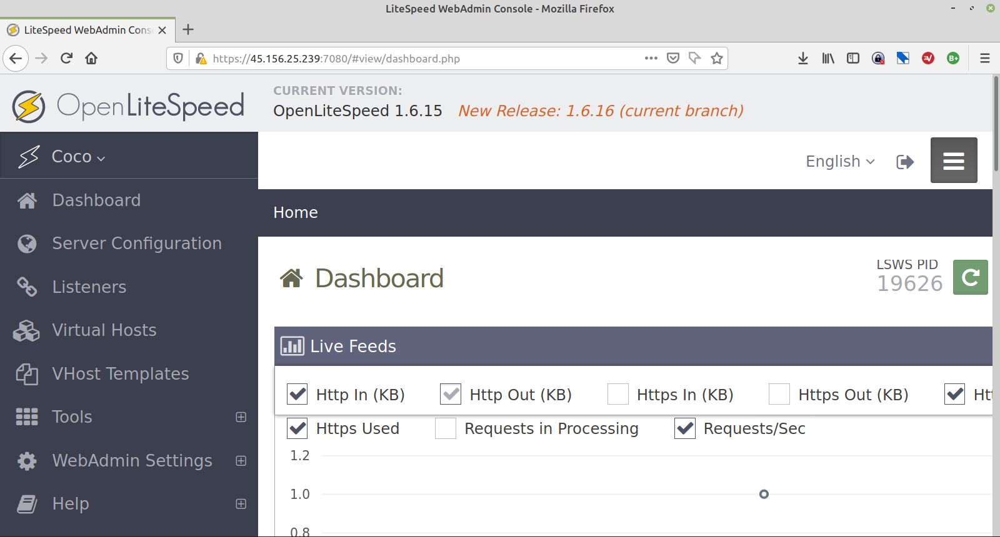
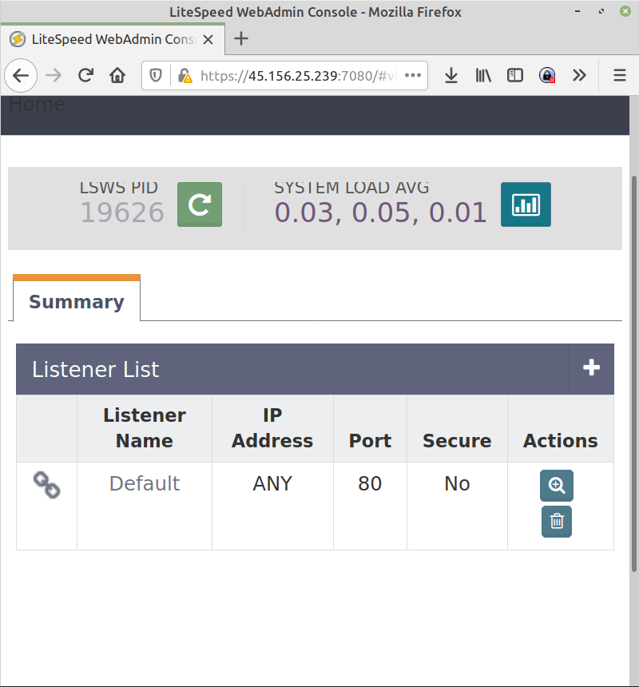
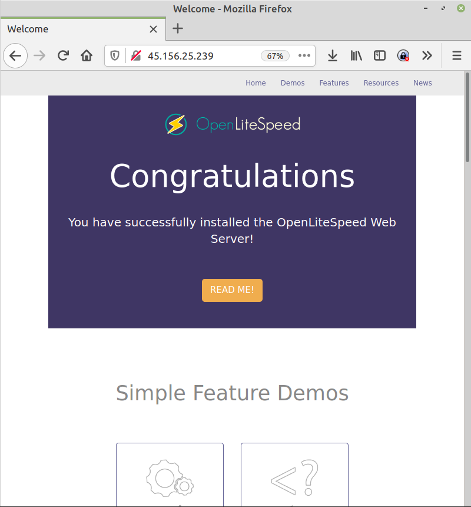

A lot of buzz around this one and many claims it is faster than Apache. Installation is not difficult.

First add the repository
sudo wget -O - http://rpms.litespeedtech.com/debian/enable_lst_debian_repo.sh | sudo bash
Then update your system and install
sudo apt update
sudo apt install openlitespeed

This is the Litespeed version of php

sudo apt install lsphp74

Extensions required by Moodle

sudo apt install graphviz aspell ghostscript clamav php7.4-pspell php7.4-curl php7.4-gd php7.4-intl php7.4-mysql php7.4-xml php7.4-xmlrpc php7.4-ldap php7.4-zip php7.4-soap php7.4-mbstring

Then enable php support - you will need to check the php version on your server. 

sudo ln -sf /usr/local/lsws/lsphp74/bin/lsphp /usr/local/lsws/fcgi-bin/lsphp5

Contr0l the server
sudo /usr/local/lsws/bin/lswsctrl start
sudo /usr/local/lsws/bin/lswsctrl restart
sudo /usr/local/lsws/bin/lswsctrl stop

Litespeed has a web admin panel so set the password for admin.
cd /usr/local/lsws/admin/misc
sudo ./admpass.sh
 
Then go to the Litespeed control Panel:
htttp://yourserver:7080

Find the listener on the left hand tree and chne the default listener from 8080to port 80 (http) or 443 (https). Your webpage should open at yous server address.

You can go to your basic page.

You can check the PHP setup.
![](litespeed4.png

